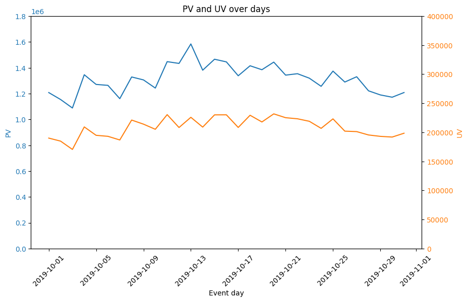
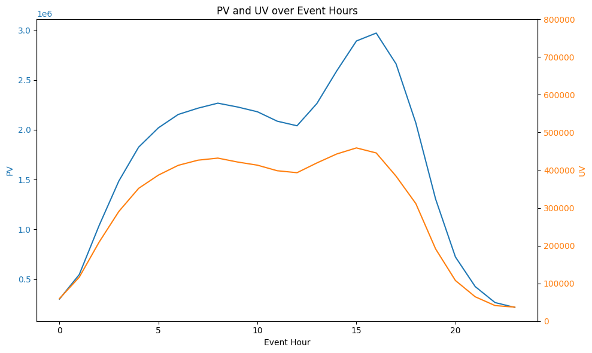
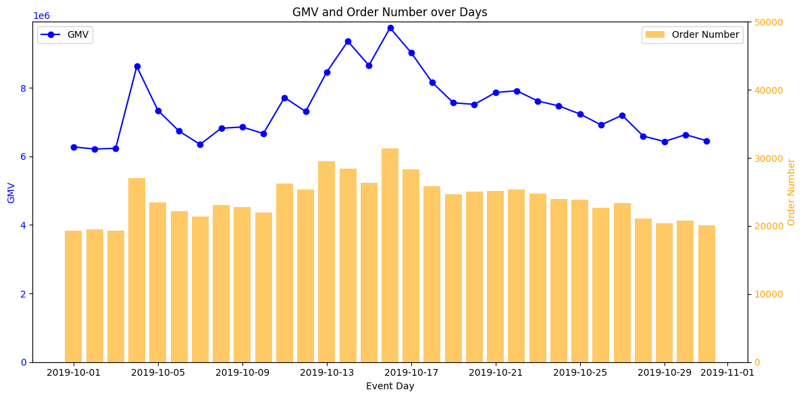
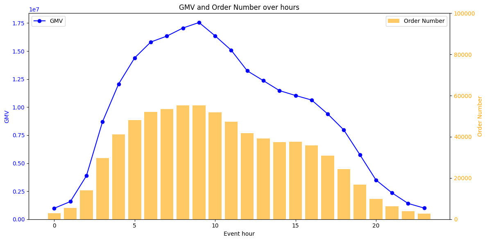
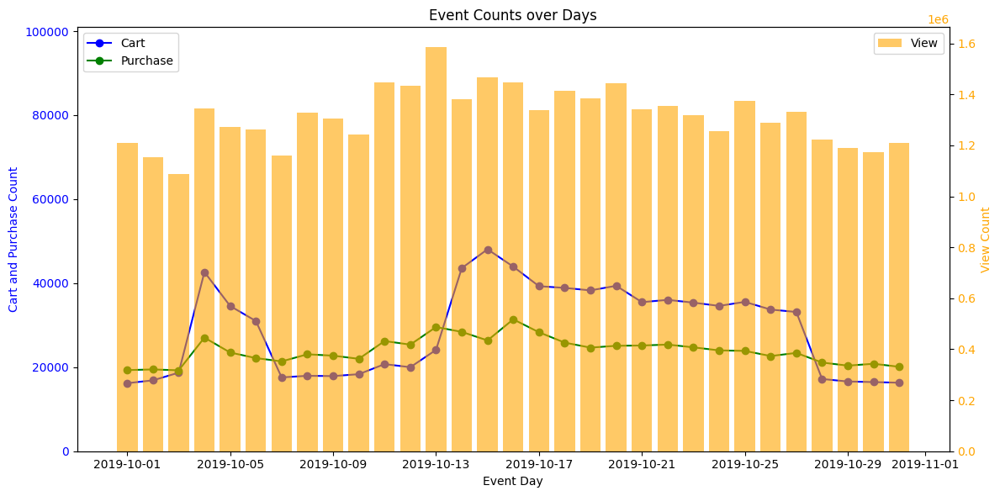
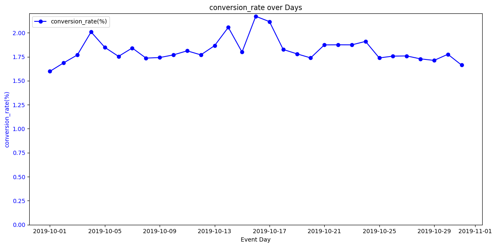
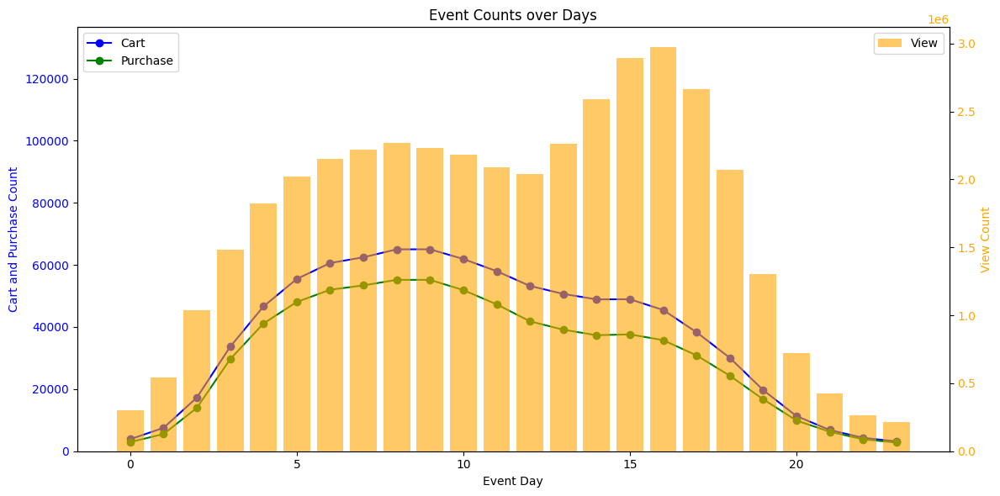
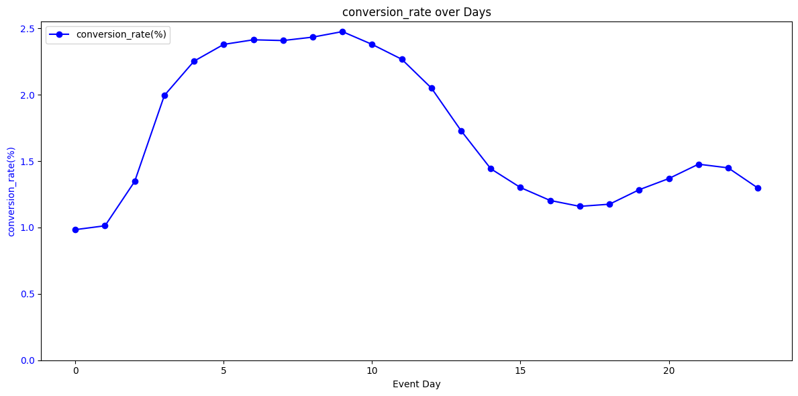
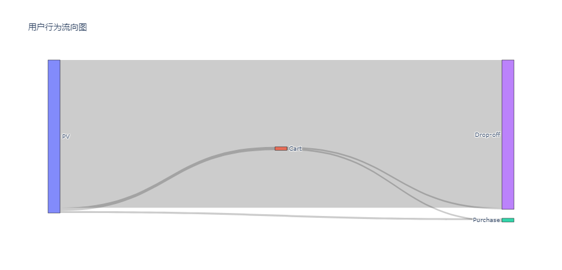
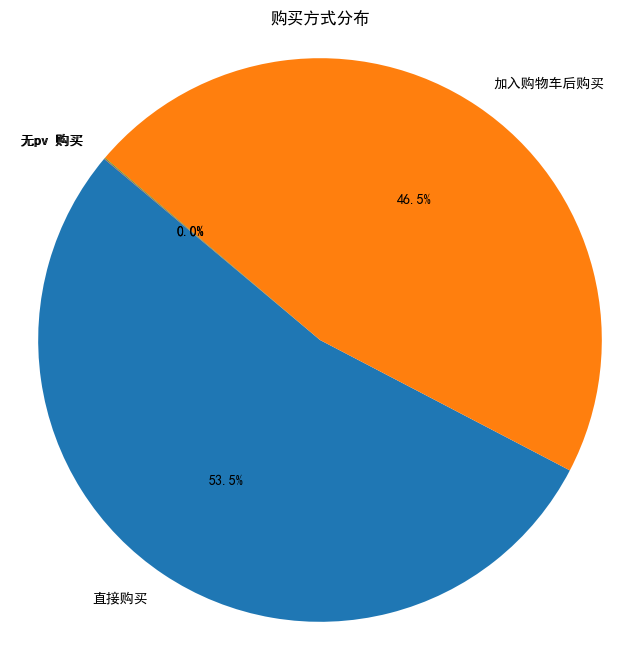

# 数据概述

**数据集**

- eCommerce behavior data from multi category store
- 某海外在线商店于2019.10的真实用户行为数据，共42448764条记录，9个字段

**数据来源**

- https://rees46.com/en/datasets 
- https://www.kaggle.com/datasets/mkechinov/ecommerce-behavior-data-from-multi-category-store/data（从中选取2019.10的数据）


**各字段含义**

| Field         | Type     | Definition                     |
| :------------ | -------- | ------------------------------ |
| event_time    | datetime | 行为发生的时间                 |
| event_type    | string   | 事件类型，有view,cart,purchase |
| product_id    | bigint   | 商品id                         |
| category_id   | bigint   | 类别id                         |
| category_code | string   | 类别名，格式：大类别.小类别    |
| brand         | string   | 品牌，一个品牌有多个类别的商品 |
| price         | float    | 商品价格                       |
| user_id       | bigint   | 用户id                         |
| user_session  | string   | 用户session_id，非主键         |


# 数据预处理

## 空值

**空值情况**

| 字段          | 空值数   |
| ------------- | -------- |
| category_code | 13515609 |
| brand         | 6117080  |
| user_session  | 2        |


**空值处理**

- 因为总共只有42m的记录，而有空值的记录有13m，全部删除不合适
- 在分析商品类别/品牌的时候去掉这些记录即可


## 重复值

**重复值情况**

- 所有字段完全重复的记录有 30220 条
- 不考虑 user_session字段时，重复的记录有 35207 条

**重复值处理**

- 应当删除前8个字段完全重复的记录（user_session不重复也删）


## 字段处理

**时间格式**

- 原数据中 `event_time` 的格式类似于 `2019-10-01 00:00:00 UTC` ，要将其改成datetime类型
- 提取日期和小时为新的字段，为`event_day `和 `event_hour`


**user_session**

- user_session 字段不同，但是其他字段都相同的记录有 57927  条
- 应该去掉user_session这个字段


**拆分商品类别**

- category_code 字段取值类似于 `appliances.environment.water_heater`，其中 `appliances `为类别，`environment`为子类别，`water_heater`为商品名
- 将 category_code 中三个字段提取为新的字段，为 `category`，`sub_category`，`product_name`


# 分析思路

**可选维度**

- 在人货场这个框架下，能选的维度只有：时间/时段，用户特征和商品特征（平台特征没有）

- 行为时间（每日/日内每小时）
- 用户：RFM，
- 商品：大分类，小分类，品牌，是否动销


**可选指标**

- 流量：PV，UV
- 销量：下单数，gmv，下单用户数，
- 转化：行为数 ，转化率
- 商品：类别数，商品数，动销商品数
- 用户：RFM


**分析方向1：指标趋势**


**用户研究**

- 用户行为路径
  - 对（一个商品，一个用户），从 pv 出发，用户的行为路径
  - pv -> 流失 ， pv -> cart -> 流失 ， pv -> 购买 ， pv -> cart -> 购买
- 下单用户路径
  - 对（一个商品，一个用户），以 下单为结束，用户的行为路径
  - pv -> 购买 ， pv -> cart -> 购买


**商品价值**

- 销售：商品下单数，gmv，单价，转化率
	- 维度：product_id ，商品类别，商品品牌，下单方式（pv -> 购买 ，pv -> cart -> 购买 ），价格区间

- 复购：复购率（一个用户多次买同一个商品）


**用户价值**

- RFM 值的分布
	- R ：一个用户 距离 10.30 最近一次下单时间
	- F： 一个用户10月下单次数
	- M：一个用户10月消费金额

- RFM 划分
	- 依据一个用户的 R，F，M 取值的百分位数，给RFM都打一个分
	-  将三项评分加起来得到RFM总分，根据总分划分人群

- 高低消费人群的商品偏好
	- 指标：订单数/gmv 
	- 维度：商品类别，品牌，价格区间
- AARRR
	- 指标：留存率，首单价，复购率（有多次购买行为的用户）


# 平台经营分析

## 流量

**指标&统计口径**

- pv：时间段内 `event_type == view` 的记录数
- uv：时间段内 `event_type == view` 的去重用户数 （unique user_id）


**全月流量情况**

- 全月 pv为 40772341， uv 为 3022130


### 每日流量情况

**总体情况**

| 指标   | PV                   | UV                 |
| ------ | -------------------- | ------------------ |
| 均值   | 1,315,236            | 208,810            |
| 中位数 | 1,328,893            | 208,456            |
| 最高点 | 1,584,488 (10月13日) | 225,923 (10月13日) |
| 最低点 | 1,088,577 (10月3日)  | 170,655 (10月3日)  |
| 方差   | 111,084.61           | 16,233.32          |
| 极差   | 495,911 (均值的37%)  | 61,171 (均值的29%) |


**趋势**

- 前半月波动上升于10.13到最高， 后半个月较平稳但有下滑趋势。
- PV UV 的变化趋势一致，UV 的波动相对 PV 较小



- summary：pv uv 的水平处于高位，但是波动较大；前半月波动上升于10.13到最高， 后半个月较平稳但有下滑趋势。PV 和 UV 之间呈现出正相关关系。


### 分时流量情况

- 趋势：

	- 从0点到15点，PV 和 UV 总体呈上升趋势，从16点开始，PV 和 UV 开始下降

	- 日内访问高峰出现在 5-10点 和 15点附近 ，且15点附近访问量更大且更集中

	- PV UV 的变化趋势一致，且最高峰都出现在 15点左右，为 2892301 和 459169，UV 的波动相对 PV 较小

		


## 销量

**指标&口径**

- 下单数：时间段内 `event_type == purchase` 的记录数
- gmv：时间段内 `event_type == purchase` 的记录中，`price` 的总和
- ATV(average transaction value)：时间段内 gmv / 下单数


**全月销售情况**

- 全月下单数为 742773 ，gmv为 229933212.63，ATV为 309.56


### 每日销售情况

**总体情况**

| 指标             | 下单数            | gmv                    |
| ---------------- | ----------------- | ---------------------- |
| 均值             | 23960             | 7417200.41             |
| 中位数           | 23883.00          | 7307691.57             |
| 最高点           | 31393 (10月16日)  | 9747164.72 (10月16日)  |
| 最低点           | 19255 (10月3日)   | 6213628.53 (10月2日)   |
| 方差（离散系数） | 3083.45（12%）    | 957899.74（13%）       |
| 极差             | 12138 (均值的50%) | 3533536.19 (均值的47%) |


**趋势**

- gmv月初较为平稳 在10.4有一个小高峰，月中呈上升趋势并于10.16触顶，后逐渐下降
- 下单数变化趋势与gmv一致，波动相对gmv较小




### **分时销售情况**

**趋势：**

- 从0点到9点，下单数 和 gmv 总体呈上升趋势，从10点开始下降

- 日内下单高峰出现在 6-10点 附近 ，下单数和gmv趋势一致




# 销售转化分析


## 行为转化

**指标&口径**

- 行为次数：时间段内 `event_type == view/cart/purchase` 的记录数
- 转化率：时间段内 purchase 次数 / view次数


**全月行为情况**

| event_type | view     | cart   | purchase | conversion_rate |
| ---------- | -------- | ------ | -------- | --------------- |
| count      | 40772341 | 898443 | 742773   | 1.82%           |


### **每日行为情况**

**总体情况**	

| 指标             | view              | cart              | purchase           | conversion_rate(%) |
| :--------------- | ----------------- | ----------------- | ------------------ | ------------------ |
| 均值             | 1315236.81        | 28982.03          | 23960.42           | 1.82               |
| 中位数           | 1328893           | 33147.00          | 23883.00           | 1.78               |
| 最高点           | 1584488(10.13)    | 48066(10.15)      | 31393(10.16)       | 2.17(10.16日)      |
| 最低点           | 1088577(10.3)     | 16193(10.1)       | 19255(10.3)        | 1.60(10.1)         |
| 方差（离散系数） | 111084.61（8%）   | 10576.36（36.5%） | 3083.45（12.9%）   |                    |
| 极差             | 495911(均值的37%) | 31873(均值的110%) | 12133(均值的50.7%) | 0.57               |


**趋势**

- pv 下单趋势如之前分析
- 加购数在 10.4-10.6 和 10.14-10.26 之间较高
- 转化率低的较为稳定，于1.75%左右波动，在 10.3-10.5 和 10.13-10.18 之间有两个小高峰






### 分时行为情况

**趋势**

- pv 高峰在14-16 时左右，加购 下单高峰在 5-10 时左右，
- 即成交主要在早上，可能晚上买了也不发货






## 用户行为路径

 **用户路径表**

- 在原表基础上新建表,每一个记录表示 一个user 对 一个product 有过的行为（月内）

    ```python
    # 新表的逻辑，具体实现见代码
    user_route = data.groupby(['product_id','user_id','event_type']).agg({'event_type': 'nunique'}).unstack().fillna(0)
    ```

- 新表的样板如下，表示 id为489962790的用户 只浏览了id为1000978的商品，但是没有加购或下单，用 1-0-0表示路径

	| product_id |   user_id | view | cart | purchase | route |
	| ---------: | --------: | ---: | ---: | -------: | ----: |
	|    1000978 | 489962790 |  1.0 |  0.0 |      0.0 | 1-0-0 |


### **用户行为路径**

- 计算时间段内（全月），每一种route的记录数

    | 路径                      | 数值     | 占比   |
    | ------------------------- | -------- | ------ |
    | 1-0-0 （直接流失）        | 22509736 | 99.43% |
    | 1-0-1 （直接下单）        | 298539   | 1.31%  |
    | 1-1-1 （加购狗下单）      | 259544   | 1.14%  |
    | 1-1-0 （加购后流失）      | 239130   | 1.05%  |
    | 0-1-0 （无pv加购后流失）  | 280      | /      |
    | 0-0-1 （无pv直接下单）    | 259      | /      |
    | 0-1-1  （无pv加购后下单） | 142      | /      |


- 用户行为流量图

	>  pyecharts绘制的图见：assests\sankey_chart.html



### **用户下单路径**

- 时间段内，下单的用户行为路径如下图
- 大多数是直接购买，




### 直接下单的商品都是什么


### 分析

1. 总体转化率不高，但是加购后的转化率高（50%）
2. 大多用户是直接下单的，也不用购物车


- 增加购物车的存在感--促进加购（其实也不一定，只是相关关系不是因果关系）


# 商品价值分析

> 按各种商品维度拆不同的指标

## 热销

> 下单指标按商品特征拆

**订单表&商品表**

- 订单表：取原表中  `event_type == purchase` 的记录，有商品交易的详细信息 
- 商品表：统计商品的特征，包括曝光次数，均价，所以不能简单用订单表groupby
	- 仅关注动销了的商品，即 `event_type == purchase`中的商品


**指标&口径**

- 下单数：分类中 `event_type == purchase` 的记录数
- gmv：分类中 `event_type == purchase` 的记录中，`price` 的总和
- ATV(average transaction value)：分类中 gmv / 下单数
- 动销商品数：分类中 `event_type == purchase` 的记录中唯一product_id 数

**所有商品**

- 下单数为 742773 ，gmv为 229933212.63，ATV为 309.56，动销商品数 42241


## 复购

一个用户多次购买一个商品


## 转化

下单/曝光

按商品特征拆


# new

总体情况

pv : 40772341，uv：3022130，pv/uv ：13.49

gmv：229933212.63，下单数：742773，ATV：309.56

下单用户数：347118，客单价：662.41，平均用户下单数：2.14


